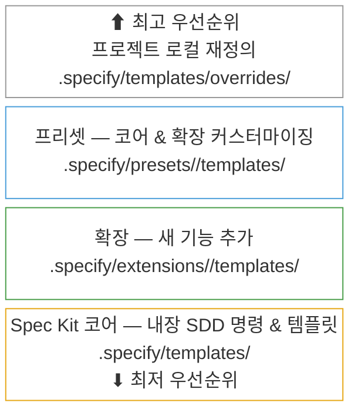

<div align="center">
    
    <h1>🌱 Spec Kit</h1>
    <h3><em>고품질 소프트웨어를 더 빠르게 구축하세요.</em></h3>
</div>

<p align="center">
    <strong>매번 바이브 코딩으로 처음부터 만드는 대신, 제품 시나리오와 예측 가능한 결과에 집중할 수 있게 해주는 오픈 소스 툴킷입니다.</strong>
</p>

<p align="center">
    <a href="https://github.com/github/spec-kit/releases/latest"></a>
    <a href="https://github.com/github/spec-kit/stargazers"></a>
    <a href="https://github.com/github/spec-kit/blob/main/LICENSE"></a>
    <a href="https://github.github.io/spec-kit/"></a>
</p>

---

## 목차

- [🤔 스펙 기반 개발이란?](#-스펙-기반-개발이란)
- [⚡ 시작하기](#-시작하기)
- [📽️ 비디오 개요](#️-비디오-개요)
- [🧩 커뮤니티 확장](#-커뮤니티-확장)
- [🎨 커뮤니티 프리셋](#-커뮤니티-프리셋)
- [🚶 커뮤니티 워크스루](#-커뮤니티-워크스루)
- [🛠️ 커뮤니티 프렌즈](#️-커뮤니티-프렌즈)
- [🤖 지원되는 AI 에이전트](#-지원되는-ai-에이전트)
- [🔧 Specify CLI 레퍼런스](#-specify-cli-레퍼런스)
- [🧩 Spec Kit 커스터마이징: 확장 & 프리셋](#-spec-kit-커스터마이징-확장--프리셋)
- [📚 핵심 철학](#-핵심-철학)
- [🌟 개발 단계](#-개발-단계)
- [🎯 실험적 목표](#-실험적-목표)
- [🔧 사전 요구 사항](#-사전-요구-사항)
- [📖 더 알아보기](#-더-알아보기)
- [📋 상세 프로세스](#-상세-프로세스)
- [🔍 문제 해결](#-문제-해결)
- [💬 지원](#-지원)
- [🙏 감사의 말](#-감사의-말)
- [📄 라이선스](#-라이선스)

## 🤔 스펙 기반 개발이란?

스펙 기반 개발(Spec-Driven Development)은 기존 소프트웨어 개발의 **패러다임을 뒤집습니다**. 수십 년간 코드가 왕이었고, 명세서는 "진짜 작업"인 코딩이 시작되면 세워두고 버리는 발판에 불과했습니다. 스펙 기반 개발은 이를 바꿉니다: **명세서가 실행 가능해지며**, 단순히 가이드 역할만 하는 것이 아니라 직접 작동하는 구현을 생성합니다.

## ⚡ 시작하기

### 1. Specify CLI 설치

원하는 설치 방법을 선택하세요:

#### 옵션 1: 영구 설치 (권장)

한 번 설치하면 어디서든 사용할 수 있습니다. 안정성을 위해 특정 릴리스 태그를 고정하세요 (최신 태그는 [Releases](https://github.com/github/spec-kit/releases)에서 확인):

```bash
# 특정 안정 릴리스 설치 (권장 — vX.Y.Z를 최신 태그로 교체)
uv tool install specify-cli --from git+https://github.com/github/spec-kit.git@vX.Y.Z

# 또는 main에서 최신 버전 설치 (미릴리스 변경 사항 포함 가능)
uv tool install specify-cli --from git+https://github.com/github/spec-kit.git
```

설치 후 도구를 직접 사용하세요:

```bash
# 새 프로젝트 생성
specify init <프로젝트_이름>

# 또는 기존 프로젝트에서 초기화
specify init . --ai claude
# 또는
specify init --here --ai claude

# 설치된 도구 확인
specify check
```

Specify 업그레이드 방법은 [업그레이드 가이드](./docs/upgrade.md)를 참조하세요. 빠른 업그레이드:

```bash
uv tool install specify-cli --force --from git+https://github.com/github/spec-kit.git@vX.Y.Z
```

#### 옵션 2: 일회성 사용

설치 없이 직접 실행:

```bash
# 새 프로젝트 생성 (안정 릴리스에 고정 — vX.Y.Z를 최신 태그로 교체)
uvx --from git+https://github.com/github/spec-kit.git@vX.Y.Z specify init <프로젝트_이름>

# 또는 기존 프로젝트에서 초기화
uvx --from git+https://github.com/github/spec-kit.git@vX.Y.Z specify init . --ai claude
# 또는
uvx --from git+https://github.com/github/spec-kit.git@vX.Y.Z specify init --here --ai claude
```

**영구 설치의 장점:**

- PATH에 도구가 설치되어 항상 사용 가능
- 셸 별칭을 만들 필요 없음
- `uv tool list`, `uv tool upgrade`, `uv tool uninstall`로 더 나은 도구 관리
- 깔끔한 셸 설정

#### 옵션 3: 엔터프라이즈 / 에어갭 설치

PyPI나 GitHub 접근이 차단된 환경이라면 [엔터프라이즈 / 에어갭 설치](./docs/installation.md#enterprise--air-gapped-installation) 가이드에서 `pip download`를 사용하여 연결된 머신에서 휴대용 OS별 휠 번들을 만드는 방법을 참조하세요.

### 2. 프로젝트 원칙 수립

프로젝트 디렉토리에서 AI 어시스턴트를 실행하세요. 대부분의 에이전트는 spec-kit을 `/speckit.*` 슬래시 명령으로 제공합니다. Codex CLI의 skills 모드에서는 `$speckit-*`를 사용합니다.

**`/speckit.constitution`** 명령을 사용하여 이후 모든 개발을 안내할 프로젝트의 거버닝 원칙과 개발 가이드라인을 작성하세요.

```bash
/speckit.constitution 코드 품질, 테스트 표준, 사용자 경험 일관성, 성능 요구 사항에 초점을 맞춘 원칙을 생성하세요
```

### 3. 스펙 작성

**`/speckit.specify`** 명령을 사용하여 만들고 싶은 것을 설명하세요. 기술 스택이 아닌 **무엇을** 그리고 **왜** 만드는지에 집중하세요.

```bash
/speckit.specify 사진을 별도의 앨범으로 정리할 수 있는 애플리케이션을 만드세요. 앨범은 날짜별로 그룹화되며 메인 페이지에서 드래그 앤 드롭으로 재구성할 수 있습니다. 앨범은 다른 앨범 안에 중첩되지 않습니다. 각 앨범 내에서 사진은 타일 형태의 인터페이스로 미리보기됩니다.
```

### 4. 기술 구현 계획 작성

**`/speckit.plan`** 명령을 사용하여 기술 스택과 아키텍처 선택을 제공하세요.

```bash
/speckit.plan 이 애플리케이션은 최소한의 라이브러리로 Vite를 사용합니다. 가능한 한 바닐라 HTML, CSS, JavaScript를 사용합니다. 이미지는 어디에도 업로드되지 않으며 메타데이터는 로컬 SQLite 데이터베이스에 저장됩니다.
```

### 5. 작업 분해

**`/speckit.tasks`**를 사용하여 구현 계획에서 실행 가능한 작업 목록을 생성하세요.

```bash
/speckit.tasks
```

### 6. 구현 실행

**`/speckit.implement`**를 사용하여 계획에 따라 모든 작업을 실행하고 기능을 구축하세요.

```bash
/speckit.implement
```

자세한 단계별 지침은 [종합 가이드](./spec-driven.md)를 참조하세요.

## 📽️ 비디오 개요

Spec Kit이 작동하는 모습을 보고 싶으신가요? [비디오 개요](https://www.youtube.com/watch?v=a9eR1xsfvHg&pp=0gcJCckJAYcqIYzv)를 시청하세요!

[](https://www.youtube.com/watch?v=a9eR1xsfvHg&pp=0gcJCckJAYcqIYzv)

## 🧩 커뮤니티 확장

> [!NOTE]
> 커뮤니티 확장은 각 작성자가 독립적으로 생성하고 관리합니다. GitHub과 Spec Kit 관리자는 커뮤니티 카탈로그에 항목을 추가하는 PR을 형식, 카탈로그 구조 또는 정책 준수를 위해 검토할 수 있지만, **확장 코드 자체를 검토, 감사, 보증 또는 지원하지 않습니다**. 커뮤니티 확장 웹사이트도 서드파티 리소스입니다. 설치 전에 확장 소스 코드를 검토하고 자신의 판단에 따라 사용하세요.

🔍 **[커뮤니티 확장 웹사이트](https://speckit-community.github.io/extensions/)에서 커뮤니티 확장을 검색하세요.**

다음 커뮤니티 기여 확장은 [`catalog.community.json`](extensions/catalog.community.json)에서 사용할 수 있습니다:

**카테고리:**

- `docs` — 스펙 아티팩트를 읽거나, 검증하거나, 생성
- `code` — 소스 코드를 검토, 검증 또는 수정
- `process` — 단계 간 워크플로우 오케스트레이션
- `integration` — 외부 플랫폼과 동기화
- `visibility` — 프로젝트 상태 또는 진행 보고

**효과:**

- `읽기 전용` — 파일을 수정하지 않고 보고서 생성
- `읽기+쓰기` — 파일 수정, 아티팩트 생성 또는 스펙 업데이트

| 확장 | 목적 | 카테고리 | 효과 | URL |
|------|------|----------|------|-----|
| AI-Driven Engineering (AIDE) | AI 어시스턴트로 처음부터 새 프로젝트를 구축하기 위한 구조화된 7단계 워크플로우 — 비전에서 구현까지 | `process` | 읽기+쓰기 | [aide](https://github.com/mnriem/spec-kit-extensions/tree/main/aide) |
| Archive Extension | 병합된 기능을 메인 프로젝트 메모리에 아카이브 | `docs` | 읽기+쓰기 | [spec-kit-archive](https://github.com/stn1slv/spec-kit-archive) |
| Azure DevOps Integration | OAuth 인증을 사용하여 사용자 스토리와 작업을 Azure DevOps 작업 항목에 동기화 | `integration` | 읽기+쓰기 | [spec-kit-azure-devops](https://github.com/pragya247/spec-kit-azure-devops) |
| Canon | 캐논 기반(베이스라인 기반) 워크플로우 추가: spec-first, code-first, spec-drift. Canon Core 프리셋 설치 필요 | `process` | 읽기+쓰기 | [spec-kit-canon](https://github.com/maximiliamus/spec-kit-canon/tree/master/extension) |
| Checkpoint Extension | 구현 중간에 변경 사항을 커밋하여 마지막에 하나의 큰 커밋만 남는 것을 방지 | `code` | 읽기+쓰기 | [spec-kit-checkpoint](https://github.com/aaronrsun/spec-kit-checkpoint) |
| Cleanup Extension | 구현 후 품질 게이트: 변경 사항 검토, 작은 이슈 수정(스카우트 룰), 중간 이슈용 작업 생성, 큰 이슈용 분석 생성 | `code` | 읽기+쓰기 | [spec-kit-cleanup](https://github.com/dsrednicki/spec-kit-cleanup) |
| Conduct Extension | 컨텍스트 오염을 줄이기 위해 서브 에이전트 위임을 통해 spec-kit 단계를 오케스트레이션 | `process` | 읽기+쓰기 | [spec-kit-conduct-ext](https://github.com/twbrandon7/spec-kit-conduct-ext) |
| Confluence Extension | 명세 및 계획 파일을 요약한 Confluence 문서 생성 | `integration` | 읽기+쓰기 | [spec-kit-confluence](https://github.com/aaronrsun/spec-kit-confluence) |
| DocGuard — CDD Enforcement | 정규 기반 개발 시행. 자동 검사, AI 기반 워크플로우, spec-kit 훅으로 프로젝트 문서 검증, 점수 매기기, 추적. NPM 런타임 의존성 없음 | `docs` | 읽기+쓰기 | [spec-kit-docguard](https://github.com/raccioly/docguard) |
| Extensify | 확장 및 확장 카탈로그 생성 및 검증 | `process` | 읽기+쓰기 | [extensify](https://github.com/mnriem/spec-kit-extensions/tree/main/extensify) |
| Fix Findings | 스펙 발견 사항을 깨끗해질 때까지 자동으로 분석-수정-재분석하는 루프 | `code` | 읽기+쓰기 | [spec-kit-fix-findings](https://github.com/Quratulain-bilal/spec-kit-fix-findings) |
| FixIt Extension | 스펙 인식 버그 수정 — 버그를 스펙 아티팩트에 매핑하고, 계획을 제안하며, 최소한의 변경 적용 | `code` | 읽기+쓰기 | [spec-kit-fixit](https://github.com/speckit-community/spec-kit-fixit) |
| Fleet Orchestrator | 모든 SpecKit 단계에 걸쳐 휴먼 인 더 루프 게이트를 갖춘 전체 기능 라이프사이클 오케스트레이션 | `process` | 읽기+쓰기 | [spec-kit-fleet](https://github.com/sharathsatish/spec-kit-fleet) |
| Iterate | 2단계 정의-적용 워크플로우로 스펙 문서 반복 — 구현 중 스펙을 다듬고 바로 빌드로 복귀 | `docs` | 읽기+쓰기 | [spec-kit-iterate](https://github.com/imviancagrace/spec-kit-iterate) |
| Jira Integration | spec-kit 명세와 작업 분해에서 Jira 에픽, 스토리, 이슈를 생성. 설정 가능한 계층 구조와 커스텀 필드 지원 | `integration` | 읽기+쓰기 | [spec-kit-jira](https://github.com/mbachorik/spec-kit-jira) |
| Learning Extension | 구현에서 교육 가이드를 생성하고 멘토링 컨텍스트로 설명을 강화 | `docs` | 읽기+쓰기 | [spec-kit-learn](https://github.com/imviancagrace/spec-kit-learn) |
| MAQA — Multi-Agent & Quality Assurance | Coordinator → feature → QA 에이전트 워크플로우. 병렬 워크트리 기반 구현. 언어 무관. 설치된 보드 플러그인 자동 감지. 선택적 CI 게이트 | `process` | 읽기+쓰기 | [spec-kit-maqa-ext](https://github.com/GenieRobot/spec-kit-maqa-ext) |
| MAQA Azure DevOps Integration | MAQA용 Azure DevOps Boards 통합 — 기능 진행에 따라 User Story와 Task 하위 항목 동기화 | `integration` | 읽기+쓰기 | [spec-kit-maqa-azure-devops](https://github.com/GenieRobot/spec-kit-maqa-azure-devops) |
| MAQA CI/CD Gate | GitHub Actions, CircleCI, GitLab CI, Bitbucket Pipelines 자동 감지. 파이프라인이 그린일 때까지 QA 핸드오프 차단 | `process` | 읽기+쓰기 | [spec-kit-maqa-ci](https://github.com/GenieRobot/spec-kit-maqa-ci) |
| MAQA GitHub Projects Integration | MAQA용 GitHub Projects v2 통합 — 기능 진행에 따라 드래프트 이슈와 Status 칼럼 동기화 | `integration` | 읽기+쓰기 | [spec-kit-maqa-github-projects](https://github.com/GenieRobot/spec-kit-maqa-github-projects) |
| MAQA Jira Integration | MAQA용 Jira 통합 — 보드를 통해 기능이 진행됨에 따라 스토리와 서브태스크 동기화 | `integration` | 읽기+쓰기 | [spec-kit-maqa-jira](https://github.com/GenieRobot/spec-kit-maqa-jira) |
| MAQA Linear Integration | MAQA용 Linear 통합 — 기능 진행에 따라 워크플로우 상태 간 이슈와 하위 이슈 동기화 | `integration` | 읽기+쓰기 | [spec-kit-maqa-linear](https://github.com/GenieRobot/spec-kit-maqa-linear) |
| MAQA Trello Integration | MAQA용 Trello 보드 통합 — 스펙에서 보드 채우기, 카드 이동, 실시간 체크리스트 체크 | `integration` | 읽기+쓰기 | [spec-kit-maqa-trello](https://github.com/GenieRobot/spec-kit-maqa-trello) |
| Onboard | spec-kit 프로젝트에 처음 참여하는 개발자를 위한 컨텍스트 기반 온보딩과 점진적 성장. 스펙 설명, 의존성 매핑, 이해도 검증, 다음 단계 안내 | `process` | 읽기+쓰기 | [spec-kit-onboard](https://github.com/dmux/spec-kit-onboard) |
| Optimize | 컨텍스트 효율성을 위한 AI 거버넌스 감사 및 최적화 — 토큰 예산, 규칙 상태, 해석 가능성, 압축, 일관성, 에코 감지 | `process` | 읽기+쓰기 | [spec-kit-optimize](https://github.com/sakitA/spec-kit-optimize) |
| Plan Review Gate | 작업 생성 전에 spec.md와 plan.md가 MR/PR을 통해 병합되어야 함 | `process` | 읽기 전용 | [spec-kit-plan-review-gate](https://github.com/luno/spec-kit-plan-review-gate) |
| Presetify | 프리셋 및 프리셋 카탈로그 생성 및 검증 | `process` | 읽기+쓰기 | [presetify](https://github.com/mnriem/spec-kit-extensions/tree/main/presetify) |
| Product Forge | 전체 제품 라이프사이클: 리서치 → 제품 스펙 → SpecKit → 구현 → 검증 → 테스트 | `process` | 읽기+쓰기 | [speckit-product-forge](https://github.com/VaiYav/speckit-product-forge) |
| Project Health Check | Spec Kit 프로젝트 진단 및 구조, 에이전트, 기능, 스크립트, 확장, git에 걸친 상태 이슈 보고 | `visibility` | 읽기 전용 | [spec-kit-doctor](https://github.com/KhawarHabibKhan/spec-kit-doctor) |
| Project Status | 현재 SDD 워크플로우 진행 상황 표시 — 활성 기능, 아티팩트 상태, 작업 완료율, 워크플로우 단계, 확장 요약 | `visibility` | 읽기 전용 | [spec-kit-status](https://github.com/KhawarHabibKhan/spec-kit-status) |
| QA Testing Extension | 스펙의 수락 기준에 대한 브라우저 기반 또는 CLI 기반 검증을 통한 체계적 QA 테스트 | `code` | 읽기 전용 | [spec-kit-qa](https://github.com/arunt14/spec-kit-qa) |
| Ralph Loop | AI 에이전트 CLI를 사용한 자율 구현 루프 | `code` | 읽기+쓰기 | [spec-kit-ralph](https://github.com/Rubiss/spec-kit-ralph) |
| Reconcile Extension | 기능 아티팩트를 외과적으로 업데이트하여 구현 드리프트 조정 | `docs` | 읽기+쓰기 | [spec-kit-reconcile](https://github.com/stn1slv/spec-kit-reconcile) |
| Repository Index | 기존 리포지토리의 개요, 아키텍처, 모듈 수준 인덱스 생성 | `docs` | 읽기 전용 | [spec-kit-repoindex](https://github.com/liuyiyu/spec-kit-repoindex) |
| Retro Extension | 메트릭, 스펙 정확도 평가, 개선 제안이 포함된 스프린트 회고 분석 | `process` | 읽기+쓰기 | [spec-kit-retro](https://github.com/arunt14/spec-kit-retro) |
| Retrospective Extension | 스펙 준수 점수, 드리프트 분석, 휴먼 게이트 스펙 업데이트를 포함한 구현 후 회고 | `docs` | 읽기+쓰기 | [spec-kit-retrospective](https://github.com/emi-dm/spec-kit-retrospective) |
| Review Extension | 코드 품질, 주석, 테스트, 에러 핸들링, 타입 디자인, 단순화를 위한 전문 에이전트를 활용한 구현 후 종합 코드 리뷰 | `code` | 읽기 전용 | [spec-kit-review](https://github.com/ismaelJimenez/spec-kit-review) |
| SDD Utilities | 중단된 워크플로우 재개, 프로젝트 상태 검증, 스펙-작업 추적성 확인 | `process` | 읽기+쓰기 | [speckit-utils](https://github.com/mvanhorn/speckit-utils) |
| Security Review | AI 기반 DevSecOps 분석을 사용한 종합 보안 감사 | `code` | 읽기 전용 | [spec-kit-security-review](https://github.com/DyanGalih/spec-kit-security-review) |
| Staff Review Extension | 스펙 대비 구현 검증, 보안, 성능, 테스트 커버리지를 확인하는 시니어 엔지니어 수준의 코드 리뷰 | `code` | 읽기 전용 | [spec-kit-staff-review](https://github.com/arunt14/spec-kit-staff-review) |
| Superpowers Bridge | 전체 라이프사이클에 걸쳐 spec-kit SDD 워크플로우 내에서 obra/superpowers 스킬 오케스트레이션 (명확화, TDD, 리뷰, 검증, 비평, 디버깅, 브랜치 완료) | `process` | 읽기+쓰기 | [superpowers-bridge](https://github.com/RbBtSn0w/spec-kit-extensions/tree/main/superpowers-bridge) |
| Ship Release Extension | 릴리스 파이프라인 자동화: 사전 점검, 브랜치 동기화, 변경 로그 생성, CI 검증, PR 생성 | `process` | 읽기+쓰기 | [spec-kit-ship](https://github.com/arunt14/spec-kit-ship) |
| Spec Critique Extension | 제품 전략과 엔지니어링 리스크 관점에서의 이중 렌즈 비판적 스펙 및 계획 검토 | `docs` | 읽기 전용 | [spec-kit-critique](https://github.com/arunt14/spec-kit-critique) |
| Spec Sync | 스펙과 구현 간의 드리프트를 감지하고 해결. AI 지원 해결과 사람의 승인 | `docs` | 읽기+쓰기 | [spec-kit-sync](https://github.com/bgervin/spec-kit-sync) |
| V-Model Extension Pack | 완전한 추적성을 갖춘 개발 스펙과 테스트 스펙의 V-모델 쌍 생성 시행 | `docs` | 읽기+쓰기 | [spec-kit-v-model](https://github.com/leocamello/spec-kit-v-model) |
| Verify Extension | 구현된 코드를 명세 아티팩트 대비 검증하는 구현 후 품질 게이트 | `code` | 읽기 전용 | [spec-kit-verify](https://github.com/ismaelJimenez/spec-kit-verify) |
| Verify Tasks Extension | 팬텀 완료 감지: tasks.md에서 [X]로 표시되었지만 실제 구현이 없는 작업 | `code` | 읽기 전용 | [spec-kit-verify-tasks](https://github.com/datastone-inc/spec-kit-verify-tasks) |

자체 확장을 제출하려면 [확장 게시 가이드](extensions/EXTENSION-PUBLISHING-GUIDE.md)를 참조하세요.

## 🎨 커뮤니티 프리셋

> [!NOTE]
> 커뮤니티 프리셋은 각 작성자가 독립적으로 생성하고 관리합니다. GitHub과 Spec Kit 관리자는 커뮤니티 카탈로그에 항목을 추가하는 PR을 형식, 카탈로그 구조 또는 정책 준수를 위해 검토할 수 있지만, **프리셋 코드 자체를 검토, 감사, 보증 또는 지원하지 않습니다**. 설치 전에 프리셋 소스 코드를 검토하고 자신의 판단에 따라 사용하세요.

다음 커뮤니티 기여 프리셋은 Spec Kit의 동작을 커스터마이징합니다 — 도구를 변경하지 않고 템플릿, 명령, 용어를 재정의합니다. 프리셋은 [`catalog.community.json`](presets/catalog.community.json)에서 사용할 수 있습니다:

| 프리셋 | 목적 | 제공 항목 | 필요 조건 | URL |
|--------|------|----------|----------|-----|
| AIDE In-Place Migration | AIDE 확장 워크플로우를 인플레이스 기술 마이그레이션(X → Y 패턴)에 적용 — 마이그레이션 목표, 검증 게이트, 지식 문서, 동작 동등성 기준 추가 | 2 템플릿, 8 명령 | AIDE 확장 | [spec-kit-presets](https://github.com/mnriem/spec-kit-presets) |
| Canon Core | 원본 Spec Kit 워크플로우를 Canon 확장과 함께 작동하도록 적용 | 2 템플릿, 8 명령 | — | [spec-kit-canon](https://github.com/maximiliamus/spec-kit-canon) |
| Explicit Task Dependencies | 명시적 `(depends on T###)` 의존성 선언과 병렬 스케줄링을 위한 실행 웨이브 DAG를 tasks.md에 추가 | 1 템플릿, 1 명령 | — | [spec-kit-preset-explicit-task-dependencies](https://github.com/Quratulain-bilal/spec-kit-preset-explicit-task-dependencies) |
| Pirate Speak (Full) | 모든 Spec Kit 출력을 해적 말투로 변환 — 스펙은 "Voyage Manifests", 계획은 "Battle Plans", 작업은 "Crew Assignments"가 됨 | 6 템플릿, 9 명령 | — | [spec-kit-presets](https://github.com/mnriem/spec-kit-presets) |
| Table of Contents Navigation | 생성된 spec.md, plan.md, tasks.md 문서에 탐색 가능한 목차 추가 | 3 템플릿, 3 명령 | — | [spec-kit-preset-toc-navigation](https://github.com/Quratulain-bilal/spec-kit-preset-toc-navigation) |
| VS Code Ask Questions | 배치 대화형 질문을 위해 `vscode/askQuestions`를 사용하도록 clarify 명령 강화 | 1 명령 | — | [spec-kit-presets](https://github.com/fdcastel/spec-kit-presets) |

자체 프리셋을 빌드하고 게시하려면 [프리셋 게시 가이드](presets/PUBLISHING.md)를 참조하세요.

## 🚶 커뮤니티 워크스루

> [!NOTE]
> 커뮤니티 워크스루는 각 작성자가 독립적으로 생성하고 관리합니다. GitHub이 **검토, 보증 또는 지원하지 않습니다**. 따라가기 전에 내용을 검토하고 자신의 판단에 따라 사용하세요.

다양한 시나리오에서 스펙 기반 개발이 실제로 어떻게 작동하는지 커뮤니티가 기여한 워크스루를 통해 확인하세요:

- **[그린필드 .NET CLI 도구](https://github.com/mnriem/spec-kit-dotnet-cli-demo)** — Timezone Utility를 .NET 단일 바이너리 CLI 도구로 빈 디렉토리에서 빌드. 전체 spec-kit 워크플로우(constitution, specify, plan, tasks, multi-pass implement)를 GitHub Copilot 에이전트로 수행.

- **[그린필드 Spring Boot + React 플랫폼](https://github.com/mnriem/spec-kit-spring-react-demo)** — Spring Boot, 임베디드 React, PostgreSQL, Docker Compose를 사용하여 LLM 성능 분석 플랫폼(REST API, 그래프, 반복 추적)을 처음부터 빌드. clarify 단계와 교차 아티팩트 일관성 분석 포함.

- **[브라운필드 ASP.NET CMS 확장](https://github.com/mnriem/spec-kit-aspnet-brownfield-demo)** — 기존 오픈소스 .NET CMS(CarrotCakeCMS-Core, C#, Razor, SQL, JavaScript, config 파일 ~307,000줄)에 두 가지 새 기능(크로스 플랫폼 Docker Compose 인프라와 토큰 인증 헤드리스 REST API)을 추가. 기존 스펙이나 constitution 없이 spec-kit이 기존 코드베이스에 어떻게 적용되는지 시연.

- **[브라운필드 Java 런타임 확장](https://github.com/mnriem/spec-kit-java-brownfield-demo)** — 기존 오픈소스 Jakarta EE 런타임(Piranha, Java, XML, JSP, HTML, config 파일 ~420,000줄, 180개 Maven 모듈)에 비밀번호 보호 서버 관리 콘솔을 추가. 기존 스펙이나 constitution 없는 대규모 멀티 모듈 Java 프로젝트에서 spec-kit 시연.

- **[브라운필드 Go / React 대시보드 데모](https://github.com/mnriem/spec-kit-go-brownfield-demo)** — **터미널에서 GitHub Copilot CLI를 사용하여** spec-kit을 구동하는 방법을 시연. NASA의 오픈소스 Hermes 지상 지원 시스템(Go)에 경량 React 기반 웹 텔레메트리 대시보드를 추가. 전체 constitution → specify → plan → tasks → implement 워크플로우가 터미널에서 작동함을 보여줌.

- **[그린필드 Spring Boot MVC + 커스텀 프리셋](https://github.com/mnriem/spec-kit-pirate-speak-preset-demo)** — 커스텀 해적 말투 프리셋을 사용하여 Spring Boot MVC 애플리케이션을 처음부터 빌드. 프리셋이 전체 spec-kit 경험을 어떻게 재구성하는지 시연: 명세서는 "Voyage Manifests", 계획은 "Battle Plans", 작업은 "Crew Assignments"가 됨 — 도구를 변경하지 않고 전체 해적 어투로 생성.

- **[그린필드 Spring Boot + React + 커스텀 확장](https://github.com/mnriem/spec-kit-aide-extension-demo)** — spec-kit에 대안적 스펙 기반 워크플로우를 추가하는 커뮤니티 확장인 **AIDE 확장** 워크스루. 상위 스펙(비전)과 하위 스펙(작업 항목)을 7단계 반복 라이프사이클(비전 → 로드맵 → 진행 추적 → 작업 큐 → 작업 항목 → 실행 → 피드백 루프)로 구성. 가족 거래 플랫폼(Spring Boot 4, React 19, PostgreSQL, Docker Compose)을 시나리오로 사용하여 확장 메커니즘이 코어 도구를 변경하지 않고 다른 스타일의 스펙 기반 개발을 어떻게 플러그인할 수 있는지 설명 — Spec Kit의 "Kit"을 진정으로 활용.

## 🛠️ 커뮤니티 프렌즈

> [!NOTE]
> 여기에 나열된 커뮤니티 프로젝트는 각 작성자가 독립적으로 생성하고 관리합니다. GitHub이 **검토, 보증 또는 지원하지 않습니다**. 설치 전에 소스 코드를 검토하고 자신의 판단에 따라 사용하세요.

Spec Kit을 확장, 시각화 또는 기반으로 구축하는 커뮤니티 프로젝트:

- **[cc-spex](https://github.com/rhuss/cc-spex)** - [Superpowers](https://github.com/obra/superpowers) 기반 품질 게이트, 스펙/코드 리뷰, git 워크트리 격리, 에이전트 팀을 통한 병렬 구현 등 조합 가능한 트레이트를 Spec Kit 위에 추가하는 Claude Code 플러그인.

- **[Spec Kit Assistant](https://marketplace.visualstudio.com/items?itemName=rfsales.speckit-assistant)** — 전체 SDD 워크플로우(constitution → specification → planning → tasks → implementation)를 위한 비주얼 오케스트레이터를 제공하는 VS Code 확장. 단계 상태 시각화, 대화형 작업 체크리스트, DAG 시각화, Claude, Gemini, GitHub Copilot, OpenAI 백엔드 지원. PATH에 `specify` CLI가 필요합니다.

## 🤖 지원되는 AI 에이전트

| 에이전트                                                                              | 지원 | 비고                                                                                                                                     |
| ------------------------------------------------------------------------------------ | ---- | ----------------------------------------------------------------------------------------------------------------------------------------- |
| [Qoder CLI](https://qoder.com/cli)                                                   | ✅   |                                                                                                                                           |
| [Kiro CLI](https://kiro.dev/docs/cli/)                                               | ✅   | `--ai kiro-cli` 사용 (별칭: `--ai kiro`)                                                                                                 |
| [Amp](https://ampcode.com/)                                                          | ✅   |                                                                                                                                           |
| [Auggie CLI](https://docs.augmentcode.com/cli/overview)                              | ✅   |                                                                                                                                           |
| [Claude Code](https://www.anthropic.com/claude-code)                                 | ✅   | `.claude/skills`에 스킬 설치; `/speckit-constitution`, `/speckit-plan` 등으로 spec-kit 호출                                              |
| [CodeBuddy CLI](https://www.codebuddy.ai/cli)                                        | ✅   |                                                                                                                                           |
| [Codex CLI](https://github.com/openai/codex)                                         | ✅   | `--ai-skills` 필요. Codex는 [skills](https://developers.openai.com/codex/skills)를 권장하고 [custom prompts](https://developers.openai.com/codex/custom-prompts)는 deprecated. Spec-kit은 Codex 스킬을 `.agents/skills`에 설치하고 `$speckit-<command>`로 호출 |
| [Cursor](https://cursor.sh/)                                                         | ✅   |                                                                                                                                           |
| [Forge](https://forgecode.dev/)                                                      | ✅   | CLI 도구: `forge`                                                                                                                         |
| [Gemini CLI](https://github.com/google-gemini/gemini-cli)                            | ✅   |                                                                                                                                           |
| [GitHub Copilot](https://code.visualstudio.com/)                                     | ✅   |                                                                                                                                           |
| [IBM Bob](https://www.ibm.com/products/bob)                                          | ✅   | 슬래시 명령 지원 IDE 기반 에이전트                                                                                                        |
| [Jules](https://jules.google.com/)                                                   | ✅   |                                                                                                                                           |
| [Kilo Code](https://github.com/Kilo-Org/kilocode)                                    | ✅   |                                                                                                                                           |
| [opencode](https://opencode.ai/)                                                     | ✅   |                                                                                                                                           |
| [Pi Coding Agent](https://pi.dev)                                                    | ✅   | Pi는 기본적으로 MCP를 지원하지 않으므로 `taskstoissues`가 의도대로 작동하지 않음. [extensions](https://github.com/badlogic/pi-mono/tree/main/packages/coding-agent#extensions)를 통해 MCP 지원 추가 가능 |
| [Qwen Code](https://github.com/QwenLM/qwen-code)                                     | ✅   |                                                                                                                                           |
| [Roo Code](https://roocode.com/)                                                     | ✅   |                                                                                                                                           |
| [SHAI (OVHcloud)](https://github.com/ovh/shai)                                       | ✅   |                                                                                                                                           |
| [Tabnine CLI](https://docs.tabnine.com/main/getting-started/tabnine-cli)             | ✅   |                                                                                                                                           |
| [Mistral Vibe](https://github.com/mistralai/mistral-vibe)                            | ✅   |                                                                                                                                           |
| [Kimi Code](https://code.kimi.com/)                                                  | ✅   |                                                                                                                                           |
| [iFlow CLI](https://docs.iflow.cn/en/cli/quickstart)                                 | ✅   |                                                                                                                                           |
| [Windsurf](https://windsurf.com/)                                                    | ✅   |                                                                                                                                           |
| [Junie](https://junie.jetbrains.com/)                                                | ✅   |                                                                                                                                           |
| [Antigravity (agy)](https://antigravity.google/)                                     | ✅   | `--ai-skills` 필요 |
| [Trae](https://www.trae.ai/)                                                         | ✅   |                                                                                                                                           |
| Generic                                                                              | ✅   | 자체 에이전트 사용 — 지원되지 않는 에이전트에는 `--ai generic --ai-commands-dir <path>` 사용                                               |

## 🔧 Specify CLI 레퍼런스

`specify` 명령은 다음 옵션을 지원합니다:

### 명령

| 명령 | 설명                                                                                                                                                                                                                                                                              |
| ------- |------------------------------------------------------------------------------------------------------------------------------------------------------------------------------------------------------------------------------------------------------------------------------------------|
| `init`  | 최신 템플릿에서 새 Specify 프로젝트 초기화                                                                                                                                                                                                                                |
| `check` | 설치된 도구 확인: `git` 및 `AGENT_CONFIG`에 설정된 모든 CLI 기반 에이전트 (예: `claude`, `gemini`, `code`/`code-insiders`, `cursor-agent`, `windsurf`, `junie`, `qwen`, `opencode`, `codex`, `kiro-cli`, `shai`, `qodercli`, `vibe`, `kimi`, `iflow`, `pi`, `forge` 등) |

### `specify init` 인수 & 옵션

| 인수/옵션        | 유형     | 설명                                                                                                                                                                                                                                                                                                                                                                                               |
| ---------------------- | -------- |-------------------------------------------------------------------------------------------------------------------------------------------------------------------------------------------------------------------------------------------------------------------------------------------------------------------------------------------------------------------------------------------|
| `<프로젝트명>`       | 인수 | 새 프로젝트 디렉토리 이름 (`--here` 사용 시 선택사항, 또는 현재 디렉토리에 `.` 사용)                                                                                                                                                                                                                                                                                                        |
| `--ai`                 | 옵션   | 사용할 AI 어시스턴트 (전체 최신 목록은 `AGENT_CONFIG` 참조). 주요 옵션: `claude`, `gemini`, `copilot`, `cursor-agent`, `qwen`, `opencode`, `codex`, `windsurf`, `junie`, `kilocode`, `auggie`, `roo`, `codebuddy`, `amp`, `shai`, `kiro-cli` (`kiro` 별칭), `agy`, `bob`, `qodercli`, `vibe`, `kimi`, `iflow`, `pi`, `forge`, 또는 `generic` (`--ai-commands-dir` 필요) |
| `--ai-commands-dir`    | 옵션   | 에이전트 명령 파일 디렉토리 (`--ai generic`과 함께 필수, 예: `.myagent/commands/`)                                                                                                                                                                                                                                                                                               |
| `--script`             | 옵션   | 사용할 스크립트 변형: `sh` (bash/zsh) 또는 `ps` (PowerShell)                                                                                                                                                                                                                                                                                                                               |
| `--ignore-agent-tools` | 플래그     | Claude Code 같은 AI 에이전트 도구 확인 건너뛰기                                                                                                                                                                                                                                                                                                                           |
| `--no-git`             | 플래그     | git 리포지토리 초기화 건너뛰기                                                                                                                                                                                                                                                                                                                                                        |
| `--here`               | 플래그     | 새 디렉토리 생성 대신 현재 디렉토리에서 프로젝트 초기화                                                                                                                                                                                                                                                                                                                 |
| `--force`              | 플래그     | 현재 디렉토리에서 초기화 시 강제 병합/덮어쓰기 (확인 건너뛰기)                                                                                                                                                                                                                                                                                                          |
| `--skip-tls`           | 플래그     | SSL/TLS 검증 건너뛰기 (비권장)                                                                                                                                                                                                                                                                                                                                               |
| `--debug`              | 플래그     | 문제 해결을 위한 상세 디버그 출력 활성화                                                                                                                                                                                                                                                                                                                                          |
| `--github-token`       | 옵션   | API 요청용 GitHub 토큰 (또는 GH_TOKEN/GITHUB_TOKEN 환경 변수 설정)                                                                                                                                                                                                                                                                                                                 |
| `--ai-skills`          | 플래그     | Prompt.MD 템플릿을 에이전트별 `skills/` 디렉토리에 에이전트 스킬로 설치 (`--ai` 필요). 나중에 확장이 추가될 때 확장 명령도 자동으로 스킬로 등록됨                                                                                                                                                                                               |
| `--branch-numbering`   | 옵션   | 브랜치 번호 매기기 전략: `sequential` (기본 — `001`, `002`, `003`, …, `1000`, … — 3자리 초과 시 자동 확장) 또는 `timestamp` (`YYYYMMDD-HHMMSS`). 타임스탬프 모드는 분산 팀에서 번호 충돌을 방지하는 데 유용                                                                                                                                                                                                  |

### 예제

```bash
# 기본 프로젝트 초기화
specify init my-project

# 특정 AI 어시스턴트로 초기화
specify init my-project --ai claude

# Cursor 지원으로 초기화
specify init my-project --ai cursor-agent

# Qoder 지원으로 초기화
specify init my-project --ai qodercli

# Windsurf 지원으로 초기화
specify init my-project --ai windsurf

# Kiro CLI 지원으로 초기화
specify init my-project --ai kiro-cli

# Amp 지원으로 초기화
specify init my-project --ai amp

# SHAI 지원으로 초기화
specify init my-project --ai shai

# Mistral Vibe 지원으로 초기화
specify init my-project --ai vibe

# IBM Bob 지원으로 초기화
specify init my-project --ai bob

# Pi Coding Agent 지원으로 초기화
specify init my-project --ai pi

# Codex CLI 지원으로 초기화
specify init my-project --ai codex --ai-skills

# Antigravity 지원으로 초기화
specify init my-project --ai agy --ai-skills

# Forge 지원으로 초기화
specify init my-project --ai forge

# 지원되지 않는 에이전트로 초기화 (generic / 자체 에이전트)
specify init my-project --ai generic --ai-commands-dir .myagent/commands/

# PowerShell 스크립트로 초기화 (Windows/크로스 플랫폼)
specify init my-project --ai copilot --script ps

# 현재 디렉토리에서 초기화
specify init . --ai copilot
# 또는 --here 플래그 사용
specify init --here --ai copilot

# 현재 (비어있지 않은) 디렉토리에 확인 없이 강제 병합
specify init . --force --ai copilot
# 또는
specify init --here --force --ai copilot

# git 초기화 건너뛰기
specify init my-project --ai gemini --no-git

# 문제 해결을 위한 디버그 출력 활성화
specify init my-project --ai claude --debug

# API 요청에 GitHub 토큰 사용 (기업 환경에 유용)
specify init my-project --ai claude --github-token ghp_your_token_here

# Claude Code는 프로젝트에 기본적으로 스킬을 설치
specify init my-project --ai claude

# 에이전트 스킬과 함께 현재 디렉토리에서 초기화
specify init --here --ai gemini --ai-skills

# 타임스탬프 기반 브랜치 번호 매기기 (분산 팀에 유용)
specify init my-project --ai claude --branch-numbering timestamp

# 시스템 요구 사항 확인
specify check
```

### 사용 가능한 슬래시 명령

`specify init`을 실행한 후 AI 코딩 에이전트는 다음과 같은 구조화된 개발 명령에 접근할 수 있습니다.

대부분의 에이전트는 아래와 같은 전통적인 점 표기 슬래시 명령을 제공합니다 (예: `/speckit.plan`).

Claude Code는 spec-kit을 스킬로 설치하고 `/speckit-constitution`, `/speckit-specify`, `/speckit-plan`, `/speckit-tasks`, `/speckit-implement`로 호출합니다.

Codex CLI의 경우 `--ai-skills`가 슬래시 명령 프롬프트 파일 대신 에이전트 스킬로 spec-kit을 설치합니다. Codex skills 모드에서는 `$speckit-constitution`, `$speckit-specify`, `$speckit-plan`, `$speckit-tasks`, `$speckit-implement`로 spec-kit을 호출합니다.

#### 핵심 명령

스펙 기반 개발 워크플로우의 필수 명령:

| 명령                 | 설명                                                              |
| ----------------------- | ------------------------------------------------------------------------ |
| `/speckit.constitution` | 프로젝트 거버닝 원칙 및 개발 가이드라인 생성 또는 업데이트 |
| `/speckit.specify`      | 빌드하고자 하는 것 정의 (요구 사항 및 사용자 스토리)            |
| `/speckit.plan`         | 선택한 기술 스택으로 기술 구현 계획 작성        |
| `/speckit.tasks`        | 구현을 위한 실행 가능한 작업 목록 생성                        |
| `/speckit.implement`    | 계획에 따라 기능을 빌드하기 위해 모든 작업 실행             |

#### 선택적 명령

향상된 품질과 검증을 위한 추가 명령:

| 명령              | 설명                                                                                                                          |
| -------------------- | ------------------------------------------------------------------------------------------------------------------------------------ |
| `/speckit.clarify`   | 불명확한 영역 명확화 (`/speckit.plan` 전에 권장; 이전 `/quizme`)                                                |
| `/speckit.analyze`   | 교차 아티팩트 일관성 & 커버리지 분석 (`/speckit.tasks` 후, `/speckit.implement` 전에 실행)                             |
| `/speckit.checklist` | 요구 사항의 완전성, 명확성, 일관성을 검증하는 커스텀 품질 체크리스트 생성 ("영어를 위한 단위 테스트"와 같음) |

### 환경 변수

| 변수          | 설명                                                                                                                                                                                                                                                                                            |
| ----------------- | ------------------------------------------------------------------------------------------------------------------------------------------------------------------------------------------------------------------------------------------------------------------------------------------------------ |
| `SPECIFY_FEATURE` | Git을 사용하지 않는 리포지토리에서 기능 감지를 재정의. 특정 기능에서 작업하려면 기능 디렉토리 이름(예: `001-photo-albums`)으로 설정하세요.<br/>\*\*`/speckit.plan` 또는 후속 명령을 사용하기 전에 사용 중인 에이전트의 컨텍스트에서 설정해야 합니다. |

## 🧩 Spec Kit 커스터마이징: 확장 & 프리셋

Spec Kit은 두 가지 보완적인 시스템인 **확장**과 **프리셋**, 그리고 일회성 조정을 위한 프로젝트 로컬 재정의를 통해 필요에 맞게 조정할 수 있습니다:



**템플릿**은 **런타임**에 해석됩니다 — Spec Kit이 스택을 위에서 아래로 순회하며 첫 번째 매치를 사용합니다. 프로젝트 로컬 재정의(`.specify/templates/overrides/`)를 사용하면 전체 프리셋을 만들지 않고 단일 프로젝트에 대한 일회성 조정이 가능합니다. **명령**은 **설치 시점**에 적용됩니다 — `specify extension add` 또는 `specify preset add`를 실행하면 명령 파일이 에이전트 디렉토리(예: `.claude/commands/`)에 기록됩니다. 여러 프리셋이나 확장이 동일한 명령을 제공하면 가장 높은 우선순위 버전이 적용됩니다. 제거 시 차순위 버전이 자동으로 복원됩니다. 재정의나 커스터마이징이 없으면 Spec Kit이 코어 기본값을 사용합니다.

### 확장 — 새 기능 추가

Spec Kit의 코어를 넘어서는 기능이 필요할 때 **확장**을 사용하세요. 확장은 새로운 명령과 템플릿을 도입합니다 — 예를 들어, 내장 SDD 명령으로 커버되지 않는 도메인 특화 워크플로우 추가, 외부 도구와의 통합, 또는 완전히 새로운 개발 단계 추가 등. Spec Kit이 *할 수 있는 것*을 확장합니다.

```bash
# 사용 가능한 확장 검색
specify extension search

# 확장 설치
specify extension add <확장명>
```

예를 들어, 확장은 Jira 통합, 구현 후 코드 리뷰, V-모델 테스트 추적성, 프로젝트 상태 진단 등을 추가할 수 있습니다.

전체 가이드와 자체 확장 빌드 및 게시 방법은 [확장 README](./extensions/README.md)를 참조하세요. 사용 가능한 확장은 위의 [커뮤니티 확장](#-커뮤니티-확장)을 참조하세요.

### 프리셋 — 기존 워크플로우 커스터마이징

새 기능을 추가하지 않고 Spec Kit의 *작동 방식*을 변경하고 싶을 때 **프리셋**을 사용하세요. 프리셋은 코어 *및* 설치된 확장과 함께 제공되는 템플릿과 명령을 재정의합니다 — 예를 들어, 컴플라이언스 지향 스펙 형식 시행, 도메인 특화 용어 사용, 또는 조직 표준을 계획과 작업에 적용. 아티팩트와 Spec Kit 및 확장이 생성하는 지침을 커스터마이징합니다.

```bash
# 사용 가능한 프리셋 검색
specify preset search

# 프리셋 설치
specify preset add <프리셋명>
```

예를 들어, 프리셋은 규제 추적성을 요구하도록 스펙 템플릿을 재구성하거나, 사용하는 방법론(예: 애자일, 칸반, 워터폴, jobs-to-be-done, 도메인 기반 설계)에 맞게 워크플로우를 조정하거나, 계획에 필수 보안 리뷰 게이트를 추가하거나, 테스트 우선 작업 순서를 시행하거나, 전체 워크플로우를 다른 언어로 현지화할 수 있습니다. [해적 말투 데모](https://github.com/mnriem/spec-kit-pirate-speak-preset-demo)는 커스터마이징이 얼마나 깊이 갈 수 있는지 보여줍니다. 여러 프리셋을 우선순위 순서로 쌓을 수 있습니다.

해석 순서, 우선순위, 자체 프리셋 만드는 방법을 포함한 전체 가이드는 [프리셋 README](./presets/README.md)를 참조하세요.

### 언제 무엇을 사용할까

| 목표 | 사용 |
| --- | --- |
| 완전히 새로운 명령이나 워크플로우 추가 | 확장 |
| 스펙, 계획, 작업의 형식 커스터마이징 | 프리셋 |
| 외부 도구나 서비스 통합 | 확장 |
| 조직 또는 규제 표준 시행 | 프리셋 |
| 재사용 가능한 도메인 특화 템플릿 제공 | 둘 다 — 템플릿 재정의에는 프리셋, 새 명령과 번들된 템플릿에는 확장 |

## 📚 핵심 철학

스펙 기반 개발은 다음을 강조하는 구조화된 프로세스입니다:

- **의도 중심 개발** — 명세서가 "*어떻게*" 전에 "*무엇을*"을 정의
- **가드레일과 조직 원칙을 사용한 풍부한 명세 생성**
- **프롬프트에서 원샷 코드 생성이 아닌 다단계 정제**
- 명세 해석을 위한 **고급 AI 모델 기능에 대한 높은 의존도**

## 🌟 개발 단계

| 단계                                    | 초점                    | 핵심 활동                                                                                                                                                     |
| ---------------------------------------- | ------------------------ | ------------------------------------------------------------------------------------------------------------------------------------------------------------------ |
| **0-to-1 개발** ("그린필드")    | 처음부터 생성    | <ul><li>상위 수준 요구 사항에서 시작</li><li>명세 생성</li><li>구현 단계 계획</li><li>프로덕션 레디 애플리케이션 빌드</li></ul> |
| **창작 탐험**                 | 병렬 구현 | <ul><li>다양한 솔루션 탐색</li><li>여러 기술 스택 & 아키텍처 지원</li><li>UX 패턴 실험</li></ul>                         |
| **반복적 개선** ("브라운필드") | 브라운필드 현대화 | <ul><li>반복적으로 기능 추가</li><li>레거시 시스템 현대화</li><li>프로세스 적응</li></ul>                                                                |

## 🎯 실험적 목표

연구 및 실험의 초점:

### 기술 독립성

- 다양한 기술 스택을 사용하여 애플리케이션 생성
- 스펙 기반 개발이 특정 기술, 프로그래밍 언어 또는 프레임워크에 종속되지 않는 프로세스라는 가설 검증

### 엔터프라이즈 제약 조건

- 미션 크리티컬 애플리케이션 개발 시연
- 조직 제약(클라우드 프로바이더, 기술 스택, 엔지니어링 관행) 통합
- 엔터프라이즈 디자인 시스템 및 컴플라이언스 요구 사항 지원

### 사용자 중심 개발

- 다양한 사용자 코호트와 선호도를 위한 애플리케이션 빌드
- 바이브 코딩에서 AI 네이티브 개발까지 다양한 개발 접근 방식 지원

### 창작 & 반복적 프로세스

- 병렬 구현 탐색 개념 검증
- 견고한 반복적 기능 개발 워크플로우 제공
- 업그레이드 및 현대화 작업을 처리하도록 프로세스 확장

## 🔧 사전 요구 사항

- **Linux/macOS/Windows**
- [지원되는](#-지원되는-ai-에이전트) AI 코딩 에이전트
- 패키지 관리를 위한 [uv](https://docs.astral.sh/uv/)
- [Python 3.11+](https://www.python.org/downloads/)
- [Git](https://git-scm.com/downloads)

에이전트 관련 이슈가 발생하면 통합을 개선할 수 있도록 이슈를 열어주세요.

## 📖 더 알아보기

- **[완전한 스펙 기반 개발 방법론](./spec-driven.md)** - 전체 프로세스 심층 분석
- **[상세 워크스루](#-상세-프로세스)** - 단계별 구현 가이드

---

## 📋 상세 프로세스

<details>
<summary>상세 단계별 워크스루를 보려면 클릭하세요</summary>

Specify CLI를 사용하여 프로젝트를 부트스트랩할 수 있으며, 환경에 필요한 아티팩트를 가져옵니다. 실행:

```bash
specify init <프로젝트명>
```

또는 현재 디렉토리에서 초기화:

```bash
specify init .
# 또는 --here 플래그 사용
specify init --here
# 디렉토리에 이미 파일이 있을 때 확인 건너뛰기
specify init . --force
# 또는
specify init --here --force
```


사용 중인 AI 에이전트를 선택하라는 메시지가 표시됩니다. 터미널에서 직접 지정할 수도 있습니다:

```bash
specify init <프로젝트명> --ai claude
specify init <프로젝트명> --ai gemini
specify init <프로젝트명> --ai copilot

# 또는 현재 디렉토리에서:
specify init . --ai claude
specify init . --ai codex --ai-skills

# 또는 --here 플래그 사용
specify init --here --ai claude
specify init --here --ai codex --ai-skills

# 비어있지 않은 현재 디렉토리에 강제 병합
specify init . --force --ai claude

# 또는
specify init --here --force --ai claude
```

CLI가 Claude Code, Gemini CLI, Cursor CLI, Qwen CLI, opencode, Codex CLI, Qoder CLI, Tabnine CLI, Kiro CLI, Pi, Forge, 또는 Mistral Vibe가 설치되어 있는지 확인합니다. 설치되어 있지 않거나 적절한 도구 확인 없이 템플릿만 가져오려면 명령에 `--ignore-agent-tools`를 사용하세요:

```bash
specify init <프로젝트명> --ai claude --ignore-agent-tools
```

### **단계 1:** 프로젝트 원칙 수립

프로젝트 폴더로 이동하여 AI 에이전트를 실행하세요. 이 예제에서는 `claude`를 사용합니다.


`/speckit.constitution`, `/speckit.specify`, `/speckit.plan`, `/speckit.tasks`, `/speckit.implement` 명령이 사용 가능하면 올바르게 설정된 것입니다.

첫 번째 단계는 `/speckit.constitution` 명령을 사용하여 프로젝트의 거버닝 원칙을 수립하는 것입니다. 이를 통해 모든 후속 개발 단계에서 일관된 의사결정을 보장합니다:

```text
/speckit.constitution 코드 품질, 테스트 표준, 사용자 경험 일관성, 성능 요구 사항에 초점을 맞춘 원칙을 생성하세요. 이 원칙이 기술 결정과 구현 선택을 어떻게 안내해야 하는지에 대한 거버넌스를 포함하세요.
```

이 단계에서 AI 에이전트가 명세, 계획, 구현 단계에서 참조할 프로젝트의 기본 가이드라인이 담긴 `.specify/memory/constitution.md` 파일이 생성되거나 업데이트됩니다.

### **단계 2:** 프로젝트 명세 작성

프로젝트 원칙이 수립되면 기능 명세를 작성할 수 있습니다. `/speckit.specify` 명령을 사용하고 개발하려는 프로젝트의 구체적인 요구 사항을 제공하세요.

> [!IMPORTANT]
> *무엇*을 만들려는지와 *왜* 만드는지에 대해 가능한 한 명시적이어야 합니다. **이 시점에서 기술 스택에 집중하지 마세요**.

예시 프롬프트:

```text
팀 생산성 플랫폼인 Taskify를 개발하세요. 사용자가 프로젝트를 생성하고, 팀 멤버를 추가하고,
작업을 할당하고, 댓글을 달고, 칸반 스타일로 보드 간에 작업을 이동할 수 있어야 합니다.
이 초기 단계 기능("Create Taskify")에서는 여러 사용자가 있지만 사용자는 미리 정의됩니다.
1명의 프로덕트 매니저와 4명의 엔지니어, 총 5명의 사용자를 두 카테고리로 나눕니다.
3개의 다른 샘플 프로젝트를 생성합니다. 각 작업 상태에 대한 표준 칸반 칼럼("할 일",
"진행 중", "검토 중", "완료")을 사용합니다. 이 애플리케이션에는 기본 기능을 확인하는
첫 번째 테스트이므로 로그인이 없습니다. 각 작업 카드의 UI에서 칸반 작업 보드의 서로 다른
칼럼 간에 작업의 현재 상태를 변경할 수 있어야 합니다. 특정 카드에 무제한의 댓글을 남길 수
있어야 합니다. 작업 카드에서 유효한 사용자 중 한 명을 할당할 수 있어야 합니다. Taskify를
처음 실행하면 선택할 5명의 사용자 목록이 표시됩니다. 비밀번호는 필요 없습니다. 사용자를
클릭하면 프로젝트 목록을 표시하는 메인 뷰로 이동합니다. 프로젝트를 클릭하면 해당 프로젝트의
칸반 보드가 열립니다. 칼럼이 보이고 서로 다른 칼럼 간에 카드를 드래그 앤 드롭할 수 있습니다.
현재 로그인한 사용자인 본인에게 할당된 카드는 다른 카드와 다른 색상으로 표시되어 빠르게
확인할 수 있습니다. 본인이 작성한 댓글은 편집할 수 있지만 다른 사람의 댓글은 편집할 수
없습니다. 본인이 작성한 댓글은 삭제할 수 있지만 다른 사람의 댓글은 삭제할 수 없습니다.
```

이 프롬프트를 입력하면 Claude Code가 계획 및 스펙 초안 작성 프로세스를 시작합니다. Claude Code는 또한 내장 스크립트를 트리거하여 리포지토리를 설정합니다.

이 단계가 완료되면 새 브랜치(예: `001-create-taskify`)가 생성되고 `specs/001-create-taskify` 디렉토리에 새 명세가 생성됩니다.

생성된 명세에는 템플릿에 정의된 사용자 스토리와 기능 요구 사항 세트가 포함됩니다.

이 단계에서 프로젝트 폴더 내용은 다음과 같습니다:

```text
└── .specify
    ├── memory
    │  └── constitution.md
    ├── scripts
    │  ├── check-prerequisites.sh
    │  ├── common.sh
    │  ├── create-new-feature.sh
    │  ├── setup-plan.sh
    │  └── update-claude-md.sh
    ├── specs
    │  └── 001-create-taskify
    │      └── spec.md
    └── templates
        ├── plan-template.md
        ├── spec-template.md
        └── tasks-template.md
```

### **단계 3:** 기능 명세 명확화 (계획 전 필수)

기본 명세가 작성되면 첫 번째 시도에서 제대로 캡처되지 않은 요구 사항을 명확히 할 수 있습니다.

기술 계획을 작성하기 **전에** 구조화된 명확화 워크플로우를 실행하여 다운스트림 재작업을 줄여야 합니다.

권장 순서:

1. `/speckit.clarify` (구조화) 사용 — 순차적, 커버리지 기반 질문으로 답변을 Clarifications 섹션에 기록.
2. 아직 모호한 부분이 있으면 선택적으로 자유 형식 정제로 후속 조치.

의도적으로 명확화를 건너뛰려면(예: 스파이크 또는 탐색적 프로토타입) 에이전트가 누락된 명확화에서 차단되지 않도록 명시적으로 언급하세요.

자유 형식 정제 프롬프트 예시 (필요시 `/speckit.clarify` 후):

```text
각 샘플 프로젝트에 5개에서 15개 사이의 가변적인 수의 작업이 있어야 하며,
각 프로젝트마다 무작위로 다른 완료 상태에 분배되어야 합니다. 각 완료 단계에
최소 하나의 작업이 있어야 합니다.
```

또한 Claude Code에게 **리뷰 & 수락 체크리스트**를 검증하도록 요청하여 요구 사항을 통과/검증하는 항목은 체크하고 그렇지 않은 항목은 체크하지 않은 채로 두어야 합니다. 다음 프롬프트를 사용할 수 있습니다:

```text
리뷰 및 수락 체크리스트를 읽고, 기능 스펙이 기준을 충족하면 체크리스트의 각 항목을 체크하세요.
충족하지 않으면 비워두세요.
```

Claude Code와의 상호작용을 명세에 대해 명확히 하고 질문할 기회로 활용하는 것이 중요합니다 — **첫 번째 시도를 최종으로 취급하지 마세요**.

### **단계 4:** 계획 생성

이제 기술 스택과 기타 기술 요구 사항에 대해 구체적으로 지정할 수 있습니다. 다음과 같은 프롬프트와 함께 프로젝트 템플릿에 내장된 `/speckit.plan` 명령을 사용할 수 있습니다:

```text
.NET Aspire를 사용하고 Postgres를 데이터베이스로 사용하여 생성합니다. 프론트엔드는
드래그 앤 드롭 작업 보드와 실시간 업데이트가 있는 Blazor 서버를 사용해야 합니다.
프로젝트 API, 작업 API, 알림 API가 있는 REST API를 생성해야 합니다.
```

이 단계의 출력에는 여러 구현 세부 문서가 포함되며 디렉토리 트리는 다음과 같습니다:

```text
.
├── CLAUDE.md
├── memory
│  └── constitution.md
├── scripts
│  ├── check-prerequisites.sh
│  ├── common.sh
│  ├── create-new-feature.sh
│  ├── setup-plan.sh
│  └── update-claude-md.sh
├── specs
│  └── 001-create-taskify
│      ├── contracts
│      │  ├── api-spec.json
│      │  └── signalr-spec.md
│      ├── data-model.md
│      ├── plan.md
│      ├── quickstart.md
│      ├── research.md
│      └── spec.md
└── templates
    ├── CLAUDE-template.md
    ├── plan-template.md
    ├── spec-template.md
    └── tasks-template.md
```

`research.md` 문서를 확인하여 지침에 따라 올바른 기술 스택이 사용되었는지 확인하세요. 구성 요소 중 눈에 띄는 것이 있으면 Claude Code에 정제를 요청하거나 사용하려는 플랫폼/프레임워크(예: .NET)의 로컬 설치 버전을 확인하도록 할 수 있습니다.

또한 빠르게 변화하는 기술 스택(예: .NET Aspire, JS 프레임워크)인 경우 선택한 기술 스택에 대한 세부 사항을 Claude Code에 조사하도록 요청할 수 있습니다:

```text
구현 계획과 구현 세부 사항을 살펴보면서 .NET Aspire가 빠르게 변화하는 라이브러리이므로
추가 조사가 도움이 될 수 있는 영역을 찾으세요. 추가 조사가 필요한 영역을 식별하면
이 Taskify 애플리케이션에서 사용할 특정 버전에 대한 추가 세부 정보로 조사 문서를
업데이트하고, 웹 조사를 사용하여 세부 사항을 명확히 하기 위해 병렬 조사 작업을 생성하세요.
```

이 과정에서 Claude Code가 잘못된 것을 조사하는 데 갇힐 수 있습니다 — 다음과 같은 프롬프트로 올바른 방향으로 안내할 수 있습니다:

```text
이것을 일련의 단계로 나눌 필요가 있다고 생각합니다. 먼저, 구현 중에 해야 할 작업 중
확신이 없거나 추가 조사가 도움이 될 작업 목록을 식별하세요. 그 작업 목록을 작성하세요.
그런 다음 각 작업에 대해 별도의 조사 작업을 시작하여 결과적으로 모든 매우 구체적인
작업을 병렬로 조사하도록 하세요. 제가 본 바로는 일반적인 .NET Aspire를 조사하는 것
같았는데 이 경우에는 그다지 도움이 되지 않을 것 같습니다. 너무 타겟팅되지 않은 조사입니다.
조사는 특정 타겟팅된 질문을 해결하는 데 도움이 되어야 합니다.
```

> [!NOTE]
> Claude Code가 요청하지 않은 구성 요소를 추가할 수 있습니다. 근거와 변경의 출처를 명확히 하도록 요청하세요.

### **단계 5:** Claude Code가 계획을 검증하도록 하기

계획이 준비되면 Claude Code가 빠진 부분이 없는지 확인하도록 해야 합니다. 다음과 같은 프롬프트를 사용할 수 있습니다:

```text
이제 구현 계획과 구현 세부 파일을 감사하세요. 이것을 읽으면서 수행해야 할 명백한
작업 순서가 있는지 판단하는 관점에서 읽으세요. 여기에 충분한 내용이 있는지 잘 모르겠기
때문입니다. 예를 들어 코어 구현을 보면 코어 구현의 각 단계를 진행하거나 정제할 때
정보를 찾을 수 있는 구현 세부 사항의 적절한 위치를 참조하는 것이 유용할 것입니다.
```

이를 통해 구현 계획을 정제하고 Claude Code가 계획 주기에서 놓친 잠재적 사각지대를 피할 수 있습니다. 초기 정제 패스가 완료되면 구현에 착수하기 전에 Claude Code에 한 번 더 체크리스트를 검토하도록 요청하세요.

또한 [GitHub CLI](https://docs.github.com/en/github-cli/github-cli)가 설치되어 있다면 Claude Code에 현재 브랜치에서 `main`으로의 상세 설명이 포함된 풀 리퀘스트를 생성하도록 요청하여 작업을 적절히 추적할 수 있습니다.

> [!NOTE]
> 에이전트가 구현하기 전에 Claude Code에 과도하게 엔지니어링된 부분이 있는지 세부 사항을 교차 확인하도록 프롬프트하는 것도 좋습니다(기억하세요 — 과도하게 적극적일 수 있습니다). 과도하게 엔지니어링된 구성 요소나 결정이 있으면 Claude Code에 해결하도록 요청할 수 있습니다. 계획을 수립할 때 Claude Code가 [constitution](base/memory/constitution.md)을 준수해야 하는 기본 문서로 따르도록 하세요.

### **단계 6:** /speckit.tasks로 작업 분해 생성

구현 계획이 검증되면 올바른 순서로 실행할 수 있는 구체적이고 실행 가능한 작업으로 계획을 분해할 수 있습니다. `/speckit.tasks` 명령을 사용하여 구현 계획에서 상세한 작업 분해를 자동으로 생성하세요:

```text
/speckit.tasks
```

이 단계에서 기능 명세 디렉토리에 다음을 포함하는 `tasks.md` 파일이 생성됩니다:

- **사용자 스토리별 작업 분해** — 각 사용자 스토리가 고유한 작업 세트를 가진 별도의 구현 단계가 됨
- **의존성 관리** — 구성 요소 간 의존성을 존중하는 순서로 작업 배치 (예: 서비스 전에 모델, 엔드포인트 전에 서비스)
- **병렬 실행 마커** — 병렬로 실행할 수 있는 작업은 `[P]`로 표시하여 개발 워크플로우 최적화
- **파일 경로 지정** — 각 작업에 구현이 이루어져야 할 정확한 파일 경로 포함
- **테스트 주도 개발 구조** — 테스트가 요청된 경우 테스트 작업이 구현 전에 작성되도록 포함 및 순서 지정
- **체크포인트 검증** — 각 사용자 스토리 단계에 독립 기능을 검증하는 체크포인트 포함

생성된 tasks.md는 `/speckit.implement` 명령을 위한 명확한 로드맵을 제공하여 코드 품질을 유지하고 사용자 스토리의 점진적 전달을 가능하게 하는 체계적인 구현을 보장합니다.

### **단계 7:** 구현

준비가 되면 `/speckit.implement` 명령을 사용하여 구현 계획을 실행하세요:

```text
/speckit.implement
```

`/speckit.implement` 명령은:

- 모든 사전 요구 사항이 갖추어졌는지 검증 (constitution, spec, plan, tasks)
- `tasks.md`에서 작업 분해를 파싱
- 의존성 및 병렬 실행 마커를 존중하며 올바른 순서로 작업 실행
- 작업 계획에 정의된 TDD 접근 방식 따르기
- 진행 상황 업데이트 제공 및 오류 적절히 처리

> [!IMPORTANT]
> AI 에이전트는 로컬 CLI 명령(예: `dotnet`, `npm` 등)을 실행합니다 — 머신에 필요한 도구가 설치되어 있는지 확인하세요.

구현이 완료되면 애플리케이션을 테스트하고 CLI 로그에 표시되지 않는 런타임 오류(예: 브라우저 콘솔 에러)를 해결하세요. 이러한 오류를 복사하여 AI 에이전트에 붙여넣어 해결할 수 있습니다.

</details>

---

## 🔍 문제 해결

### Linux에서 Git Credential Manager

Linux에서 Git 인증에 문제가 있는 경우 Git Credential Manager를 설치할 수 있습니다:

```bash
#!/usr/bin/env bash
set -e
echo "Git Credential Manager v2.6.1 다운로드 중..."
wget https://github.com/git-ecosystem/git-credential-manager/releases/download/v2.6.1/gcm-linux_amd64.2.6.1.deb
echo "Git Credential Manager 설치 중..."
sudo dpkg -i gcm-linux_amd64.2.6.1.deb
echo "Git이 GCM을 사용하도록 설정 중..."
git config --global credential.helper manager
echo "정리 중..."
rm gcm-linux_amd64.2.6.1.deb
```

## 💬 지원

지원이 필요하면 [GitHub 이슈](https://github.com/github/spec-kit/issues/new)를 열어주세요. 버그 리포트, 기능 요청, 스펙 기반 개발 사용에 대한 질문을 환영합니다.

## 🙏 감사의 말

이 프로젝트는 [John Lam](https://github.com/jflam)의 작업과 연구에 크게 영향을 받았으며 이를 기반으로 합니다.

## 📄 라이선스

이 프로젝트는 MIT 오픈 소스 라이선스 조건에 따라 라이선스가 부여됩니다. 전체 조건은 [LICENSE](./LICENSE) 파일을 참조하세요.
